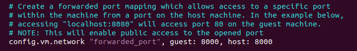
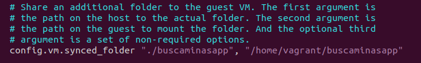
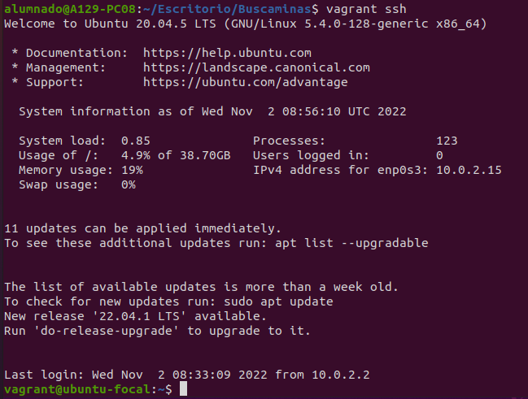
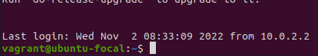
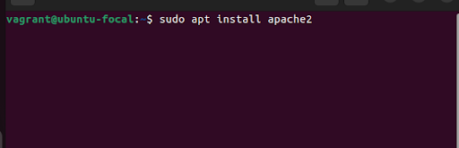
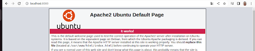
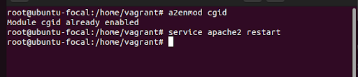
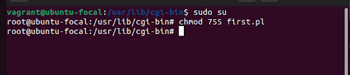
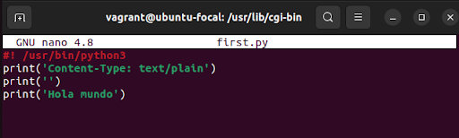
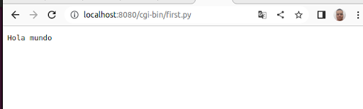

# INICIO CON VAGRANT

_En este taller aprendereís a como crear una maquina Vagrant, instalar apache en el y usar scripts de Python y Perl en él_

## Ventajas y Desventajas de Vagrant
_Veremos las principales ventajas y desventajas de usar las maquinas Vagrant_

### VENTAJAS

* Simple workfow (optimización y automatización del trabajo) para obtemer Maquinas Virtuales correctamente configuradas sin tener que lidiar con     el sistema de virtualización.

* Es multiplataforma, es decir, admite todos los sistemas disponibles (Linux, Windows, Mac OS)

* Dentro de nuestra maquina podemos replicar la misma configuración que en nuestro servidor de producción, de hecho muchas empresas usan vagrant para definir entornos de desarrollo

* Los entornos virtuales se crean para cada proyecto: todo proyecto corre aislado de los demás proyectos.

* Los desarrolladores no necesitan una conexión de red para hacer su trabajo.

* Cada desarrollador puede crear, destruir y recrear los entornos virtuales en minutos.


### DESVENTAJAS

* Las máquinas de los desarrolladores ejecutan las VM con una penalidad en la performance, y por ello deben ser de suficientes recursos en RAM y CPU para que sean usadas con eficacia.

* Algunas combinaciones de sistema operativo en el anfitrión y plataforma de virtualización no son funcionales.(Por ejemplo linux solo admite arquitexturas de 64 bits)


## Inicializando con Vagrant🚀

_Para empezar, debemos asegurarnos de tener los requisitos:_

Mira **Deployment** para conocer como desplegar el proyecto.


### Requisitos 📋
_Realizamos una actualización de las librerias_

```
sudo apt update
```

_Comprobamos que tenemos instalado **Virtual Box**_

```
virtualbox --version
```

_Si no lo tenemos instalado_

```
sudo apt install virtualbox
```


### Instalación Vagrant 🔧

_Una vez realizado los requisitos, pasamos a instalar **Vagrant** pero antes comprobamos si lo tenemos instalado_

```
vagrant --version
```

_Si lo tenemos instalado pasa al siguiente apartado, sino escribe el siguiente comando, el cual descarga vagrant:_

```
wget -O- https://apt.releases.hashicorp.com/gpg | gpg --dearmor | sudo tee /usr/share/keyrings/hashicorp-archive-keyring.gpg
```

_Cuando finalice la descarga escribimos:_

```
sudo apt install vagrant
```


### Un paseo por VagrantFIle

_Al crear una maquina vagrant, se nos creará en la carpeta un archivo llamado VargantFile, en el se guarda la configuración de la maquina vagrant, adentremonos en el :D_

_Dentro del archvio, nos interesan 2 lineas comentadas:_

```
config.vm.network "forwarded_port", guest: 80, host: 8080
```



_En esta linea lo que indica es que nos meteremos a la maquina virtual desde el puerto 8080_

```
config.vm.synced_folder "../carpeta-cgi", "/usr/lib/cgi-bin"
```




_Esta otra sin embargo la usamos para compartir una carpeta en común, es decir, podremos modificar los archivos de la maquina virtual


## INICIANDO CON VAGRANT ⚙️

_Para iniciar con vagrant primero nos ubicamos en la carpeta donde queremos que esté nuestro vagrant, despues buscaremos en [Vagrant Boxes](https://app.vagrantup.com/boxes/search) y buscar un sistema operativo que nos interese, en este caso es el sistema operativo **Ubuntu** focal64_

```
vagrant init ubuntu/focal64
```

_Esperamos a que se descargue, cuando termine iniciaremos nuestra maquina vagrant (desde el repositorio en el paso anterior) y ponemos:_
_**SOLO SE PUEDE TENER UNA MAQUINA VIRTUAL POR PUERTO**

```
vagrant up
```

_Esperamos un poco y si queremos introducirnos dentro de la maquina vargant utilizamos el comando:_

```
vagrant ssh
```



_Al meternos en la maquina vargant, nuestro prompt habrá cambiado a algo tal que así:_

**vagrant@ubutu-focal**




# INTRODUCCIÓN A APACHE

### ¿Qué es apache?

Apache HTTP Server es un software de servidor web gratuito y de código abierto para plataformas Unix con el cual se ejecutan el 46% de los sitios web de todo el mundo.
Por defecto, el servidor web Apache toma instrucciones para escuchar la conexión entrante y vincularse al puerto 80 del equipo


## INSTALAR APACHE2 🔩

_Nos introducimos dentro de la maquina vargant y escrbimos en la terminal:_

```
sudo apt update
```

_A continuación instalamos el paquete:_

```
sudo apt install apache2
```



_Para verificar si apache está iniciado en nuestra maquina virtual:_

```
systemctl status apache2
```

_Ahora su nos dirigimos al navegador y escribimos **localhost:8000**, nos dirigirá a un fichero html con informacion de apache y su configuración_





Para saber si el apache esta funcionando ejecutamos la instrucción 

`sudo service apache2 status`

Si funciona correctamente, si buscamos en nuestro navegador `localhost:8080`
nos debería de aparecer una web de bienvenida de apache


## Módulo cgi para poder interpretar programas


Tenemos que activar el modulo y reiniciar apache

Con sudo `a2enmod cgid` y `service apache2 restart`




Abrimos en visual estudio la carpeta compartida, y 
creamos un nuevo fichero que se llame `first.py` 

A este fichero tenemos que darle permisos de ejecución
con `sudo chmod 775 first.py`




Editamos el fichero con visual estudio y escribimos los siguiente




Si hemos hecho todos los pasos correctamente, buscamos en nuestro navegador 
la sigueinte ruta `localhost:8080/cgi-bin/first.py`





### Y las pruebas de estilo de codificación ⌨️

_Explica que verifican estas pruebas y por qué_

```
Da un ejemplo
```

## Despliegue 📦

_Agrega notas adicionales sobre como hacer deploy_

## Construido con 🛠️

_Menciona las herramientas que utilizaste para crear tu proyecto_

* [Dropwizard](http://www.dropwizard.io/1.0.2/docs/) - El framework web usado
* [Maven](https://maven.apache.org/) - Manejador de dependencias
* [ROME](https://rometools.github.io/rome/) - Usado para generar RSS

## Contribuyendo 🖇️

Por favor lee el [CONTRIBUTING.md](https://gist.github.com/villanuevand/xxxxxx) para detalles de nuestro código de conducta, y el proceso para enviarnos pull requests.

## Wiki 📖

Puedes encontrar mucho más de cómo utilizar este proyecto en nuestra [Wiki](https://github.com/tu/proyecto/wiki)

## Versionado 📌

Usamos [SemVer](http://semver.org/) para el versionado. Para todas las versiones disponibles, mira los [tags en este repositorio](https://github.com/tu/proyecto/tags).

## Autores ✒️

_Menciona a todos aquellos que ayudaron a levantar el proyecto desde sus inicios_

* **Andrés Villanueva** - *Trabajo Inicial* - [villanuevand](https://github.com/villanuevand)
* **Fulanito Detal** - *Documentación* - [fulanitodetal](#fulanito-de-tal)

También puedes mirar la lista de todos los [contribuyentes](https://github.com/your/project/contributors) quíenes han participado en este proyecto. 

## Licencia 📄

Este proyecto está bajo la Licencia (Tu Licencia) - mira el archivo [LICENSE.md](LICENSE.md) para detalles

## Expresiones de Gratitud 🎁

* Comenta a otros sobre este proyecto 📢
* Invita una cerveza 🍺 o un café ☕ a alguien del equipo. 
* Da las gracias públicamente 🤓.
* Dona con cripto a esta dirección: `0xf253fc233333078436d111175e5a76a649890000`
* etc.


---
⌨️ con ❤️ por [Villanuevand](https://github.com/Villanuevand) 😊

## HOLA 

_un hola mundo en el python jeje_

## DISCOTECA

_Programa con if, que dependiendo de la edad deja entrar en la discoteca o no_

## MUL

_No se multiplicar_

## Dia mes

_Muestre los dias del mes_